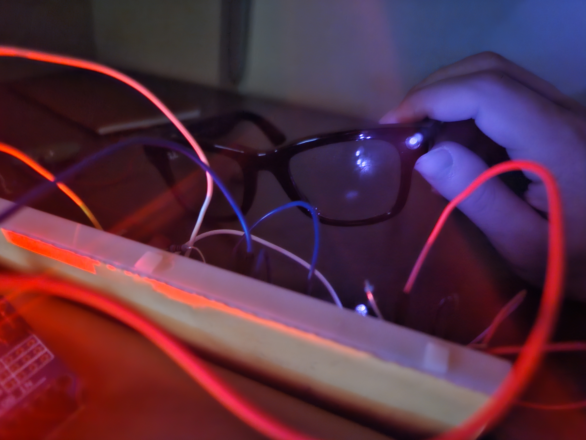
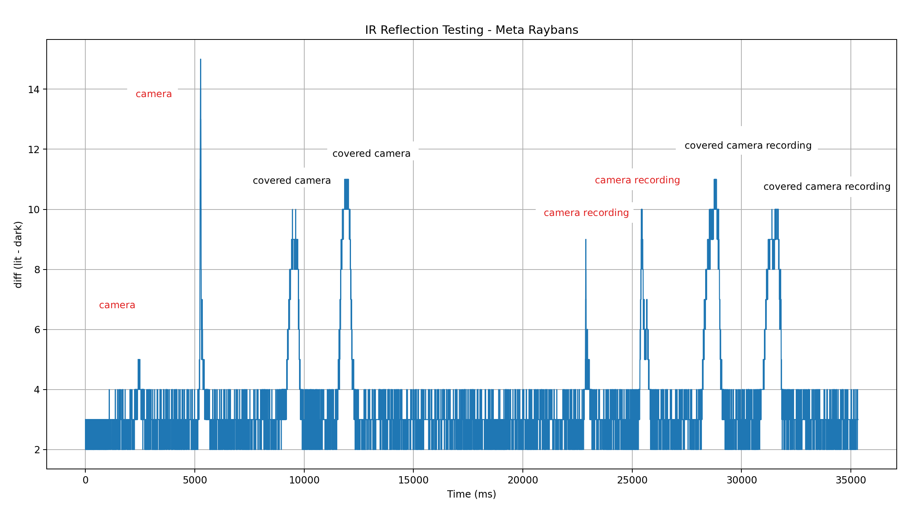
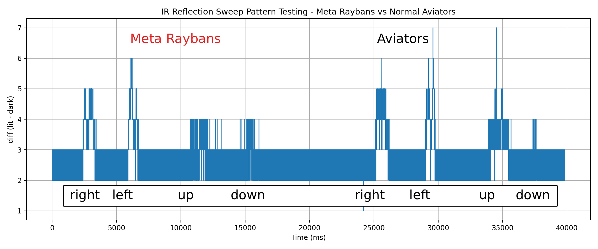

# Ban-Rays
**Glasses that detect hidden cameras in other smart glasses**

I'm planning to use 2 main approaches:
* [Optics](#optics): classify the camera using light reflections.
* [Networking](#networking): bluetooth and wi-fi analysis. (so far this is seeming much more likely to work well)

I'm essentially treating this README like a logbook, so it will have my current approaches/ideas.

## Optics

By sending IR at camera lenses, we can take advantage of the fact that the CMOS sensor in a camera reflects light directly back at the source (called 'retro-reflectivity' / 'cat-eye effect') to identify cameras.



This isn't exactly a new idea. Some researchers in 2005 used this property to create 'capture-resistant environments' when smartphones with cameras were gaining popularity. 
* https://homes.cs.washington.edu/~shwetak/papers/cre.pdf

There's even some recent research (2024) that figured out how to classify individual cameras based on their retro-reflections.
* https://opg.optica.org/oe/fulltext.cfm?uri=oe-32-8-13836

Now we have a similar situation to those 2005 researchers on our hands, where smart glasses with hidden cameras seem to be getting more popular. So I want to create a pair of glasses to identify these. Unfortunately, from what I can tell most of the existing research in this space records data with a camera and then uses ML, a ton of controlled angles, etc. to differentiate between normal reflective surfaces and cameras. 

I would feel pretty silly if my solution uses its own camera. So I'll be avoiding that. Instead I think it's likely I'll have to rely on being consistent with my 'sweeps', and creating a good classifier based on signal data. For example you can see here that the back camera on my smartphone seems to produce quick and large spikes, while the glossy screen creates a more prolonged wave. 


After getting to test some Meta Raybans, I found that this setup is not going to be sufficient. Here's a test of some sweeps of the camera-area + the same area when the lens is covered. You can see the waveform is similar to what I saw in the earlier test (short spike for camera, wider otherwise), but it's wildly inconsistent and the strength of the signal is very weak. This was from about 4 inches away from the LEDs. I didn't notice much difference when swapping between 940nm and 850nm LEDs.



So at least with current hardware that's easy for me to access, this probably isn't enough to differentiate accurately.

Another idea I had is to create a designated sweep 'pattern'. The user (wearing the detector glasses) would perform a specific scan pattern of the target. Using the waveforms captured from this data, maybe we can more accurately fingerprint the raybans. For example, sweeping across the targets glasses in a 'left, right, up, down' approach. I tested this by comparing the results of the Meta raybans vs some aviators I had lying around. I think the idea behind this approach is sound, but it might need more workshopping.



### IR Circuit

For prototyping, I'm using:
* Arduino uno
* a bunch of 940nm and 850nm IR LEDs
* a photodiode as a receiver
* a 2222A transistor


TODO:
* experiment with sweeping patterns
* experiment with combining data from different wavelengths
* collimation?

## Networking

This has been more tricky than I first thought! My current approach here is to fingerprint the Meta Raybans over Bluetooth low-energy (BLE) advertisements. But, **I have only been able to detect BLE traffic during 1) pairing 2) powering-on**. The goal is to detect them during usage when they're communicating with the paired phone, but that all seems to be happening over bluetooth classic. And unfortunately the hardware to monitor for ongoing bluetooth classic traffic seems a bit more involved (read: expensive). So I'll likely need a more clever solution here (let me know if you have any).

When turned on or put into pairing mode, I can detect the device through advertised manufacturer data. The `0x01AB` is a Meta-specific SIG-assigned ID (assigned by the Bluetooth standards body).

capture when the glasses are powered on:
```
[01:07:06] RSSI: -59 dBm
Address: XX:XX:XX:XX:XX:XX
Name: Unknown

META/LUXOTTICA DEVICE DETECTED!
  Manufacturer: Meta (0x01AB)
  Service UUID: Meta (0xFD5F) (0000fd5f-0000-1000-8000-00805f9b34fb)

Manufacturer Data:
  Company ID: Meta (0x01AB)
  Data: 020102102716e4

Service UUIDs: ['0000fd5f-0000-1000-8000-00805f9b34fb']
```

IEEE assigns certain MAC address prefixes (OUI, 'Organizationally Unique Identifier'), but these addresses get randomized so I don't expect them to be super useful for BLE.

There are also SIG Assigned Service UUIDs, for example `0xFD5F` is assigned to Meta. This is probably a proprietary service. Maybe useful.

Here's some links to more data if you're curious:
* https://www.bluetooth.com/wp-content/uploads/Files/Specification/HTML/Assigned_Numbers/out/en/Assigned_Numbers.pdf
* https://gitlab.com/wireshark/wireshark/-/blob/99df5f588b38cc0964f998a6a292e81c7dcf0800/epan/dissectors/packet-bluetooth.c
* https://www.netify.ai/resources/macs/brands/meta


TODO:
* Read: https://dl.acm.org/doi/10.1145/3548606.3559372
* try active probing/interrogating

---

Thanks to Trevor Seets and Junming Chen for their advice in optics and BLE (respectively). Also to Sohail for lending me meta raybans to test with. 