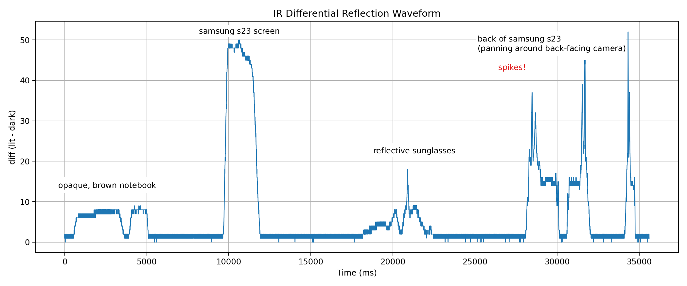
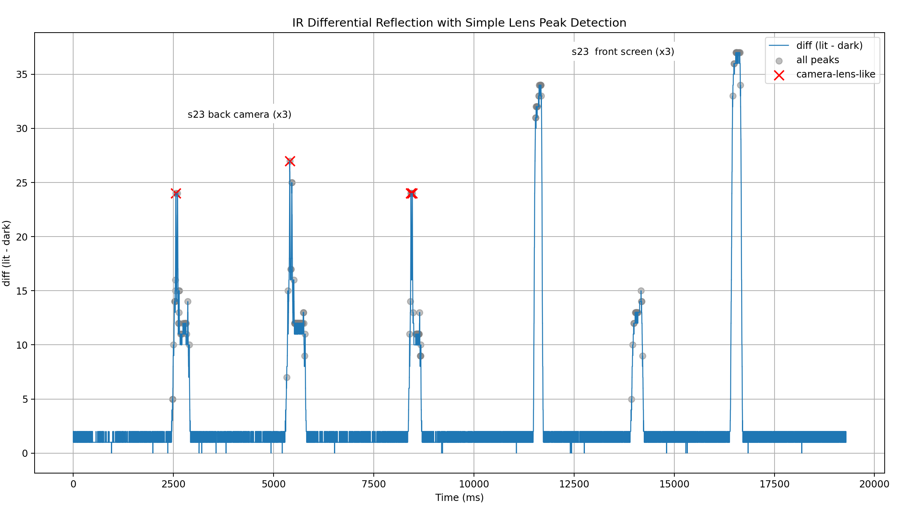
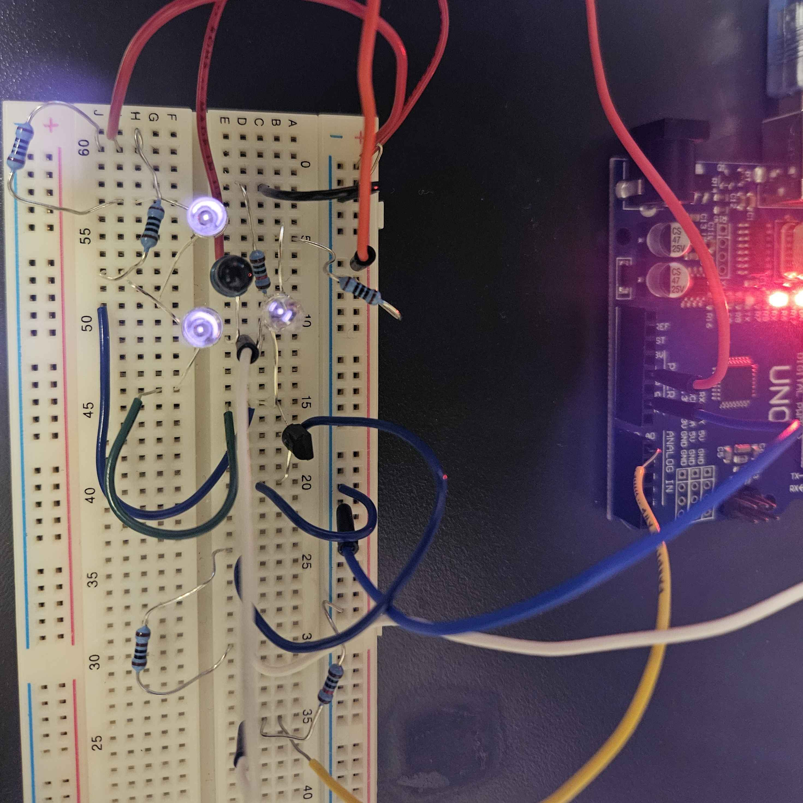

# Ban-Rays
**Glasses that detect hidden cameras in other smart glasses**

I'm planning to use 2 main approaches: optics and networking
* With optics, the goal will be to classify all cameras by looking at light reflections.
* With networking, I'll likely be looking for specific, hardcoded identifiers for relevant products in bluetooth packets. 

## Optics

By sending IR at camera lenses, we can take advantage of the fact that the CMOS sensor in a camera reflects light directly back at the source (called 'retro-reflectivity' / 'cat-eye effect') to identify cameras.

To my dissapointment, this isn't exactly a new idea. Some researchers in 2005 used this property to create 'capture-resistant environments' when smartphones with cameras were gaining popularity. 
* https://homes.cs.washington.edu/~shwetak/papers/cre.pdf

There's even some recent research (2024) that figured out how to classify individual cameras based on their retro-reflections.
* https://opg.optica.org/oe/fulltext.cfm?uri=oe-32-8-13836

Now we have a similar situation to those 2005 researchers on our hands, where smart glasses with hidden cameras seem to be getting more popular. So I want to create a pair of glasses to identify these. Unfortunately, from what I can tell most of the existing research in this space records data with a camera and then uses ML, a ton of controlled angles, etc. to differentiate between normal reflective surfaces and cameras. 

I would feel pretty silly if my solution uses its own camera. So I'll be avoiding that. Instead I think it's likely I'll have to rely on being consistent with my 'sweeps', and creating a good classifier based on signal data. For example you can see here that the back camera on my smartphone seems to produce quick and large spikes, while the glossy screen creates a more prolonged wave. 





Right now the spike / camera-like detection is super dependent on the consistensy of 'scans'. If you looks across a reflective object quickly, the slope might be enough to classify as a small camera spike.

### IR Circuit

For prototyping, I'm using:
* Arduino uno
* a bunch of 940nm and 850nm IR LEDs (the 850nm ones appear to reflect much more) 
* a photodiode as a receiver
* a 2222A transistor



I still need to experiment with how different wavelengths effect results here.

## Networking

This has been more tricky than I first thought! My current approach here is to fingerprint the Meta Raybans over Bluetooth low-energy (BLE).
When put into pairing mode, I can detect the device through advertised manufacturer data (and the device names gets broadcast too for UX). The `0x01AB` is a Meta-specific SIG-assigned ID (assigned by the Bluetooth standards body).
```
Detection Method: MANUFACTURER ID
Device: RB Meta 00Y7
MAC: XX:XX:XX:XX:XX:XX
RSSI: -61
Mfg Data: AB 01 02 01 03 8E 2A 87 F3 08 B9 01
Company ID: 0x01AB (Meta Platforms, Inc.)
```
IEEE assigns certain MAC address prefixes (OUI, 'Organizationally Unique Identifier'), but devices tend to randomize the addresses, so this might not be very useful. (NOTE: I might be misunderstanding something here)

There are also SIG Assigned Service UUIDs, and using nRF Connect (android app) I noticed that there's a service under 0xFD5F, which is assigned to Meta. This is probably a proprietary service. Maybe useful.

I'm still trying to figuring out how to fingerprint the device while in typical use (and not in pairing mode)

Here's some links to more data if you're curious:
* https://bitbucket.org/bluetooth-SIG/public/raw/adafcaea89c1469380268723c1e79ef8c84c53e9/assigned_numbers/company_identifiers/company_identifiers.yaml
* https://gitlab.com/wireshark/wireshark/-/blob/99df5f588b38cc0964f998a6a292e81c7dcf0800/epan/dissectors/packet-bluetooth.c
* https://www.netify.ai/resources/macs/brands/meta


TO TRY: filtering by rssi strength with wireshark to try and isolate the raybans while in use. also active probing.

---

Thanks to Trevor Seets and Junming Chen for their advice in optics and BLE (respectively). Also to Sohail for lending me meta raybans to test with. 