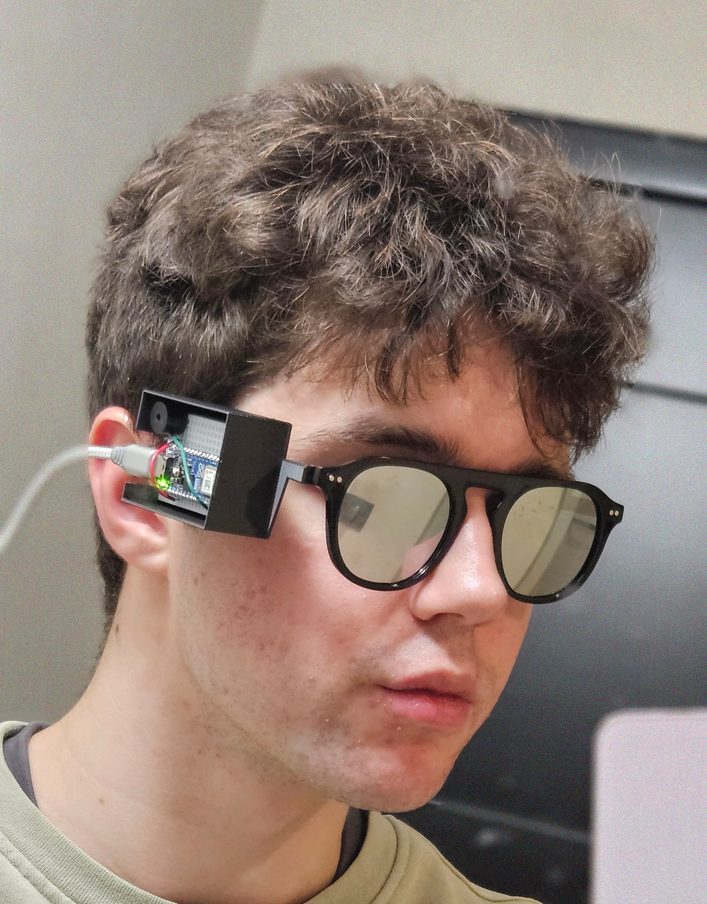
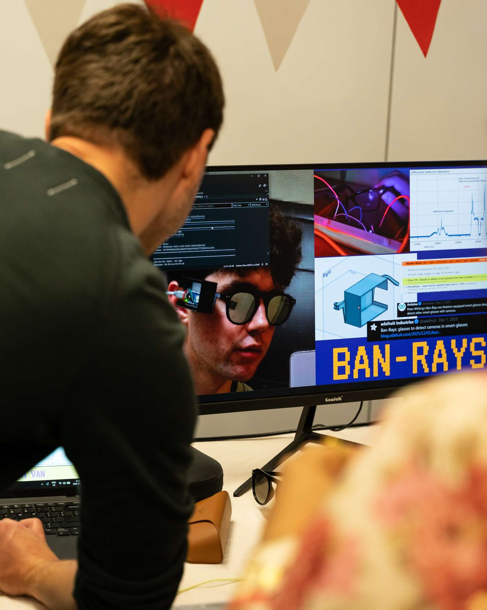
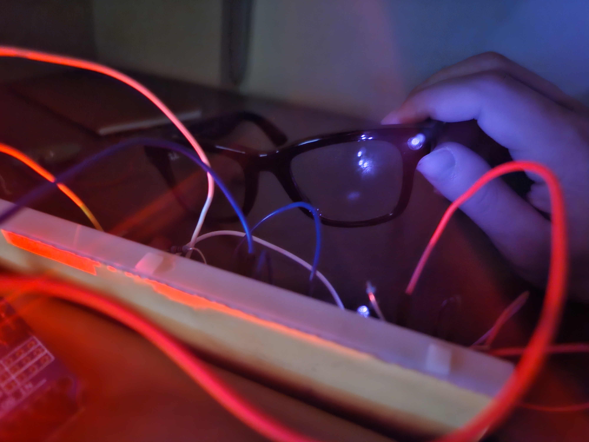
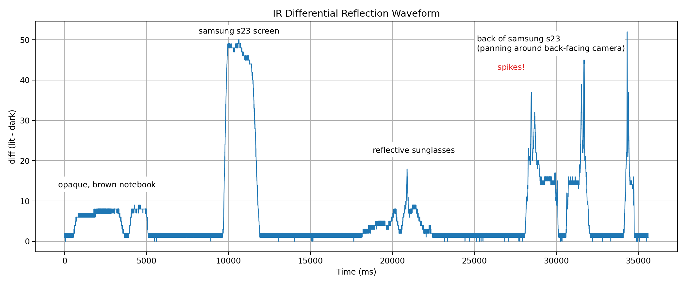
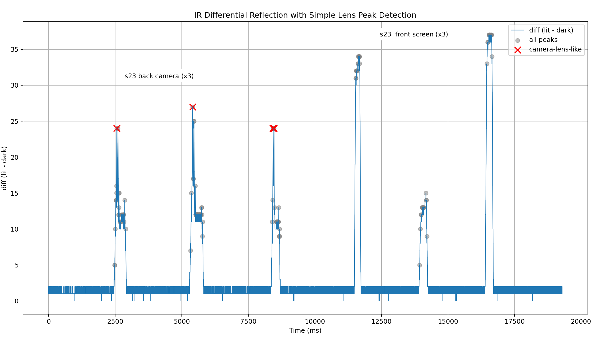
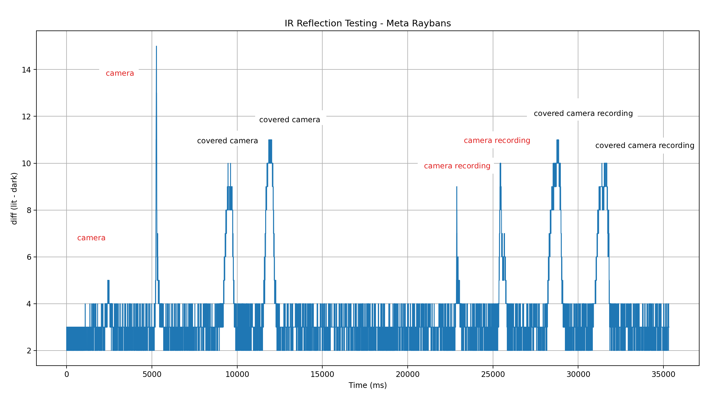
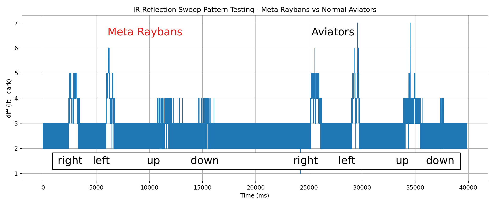
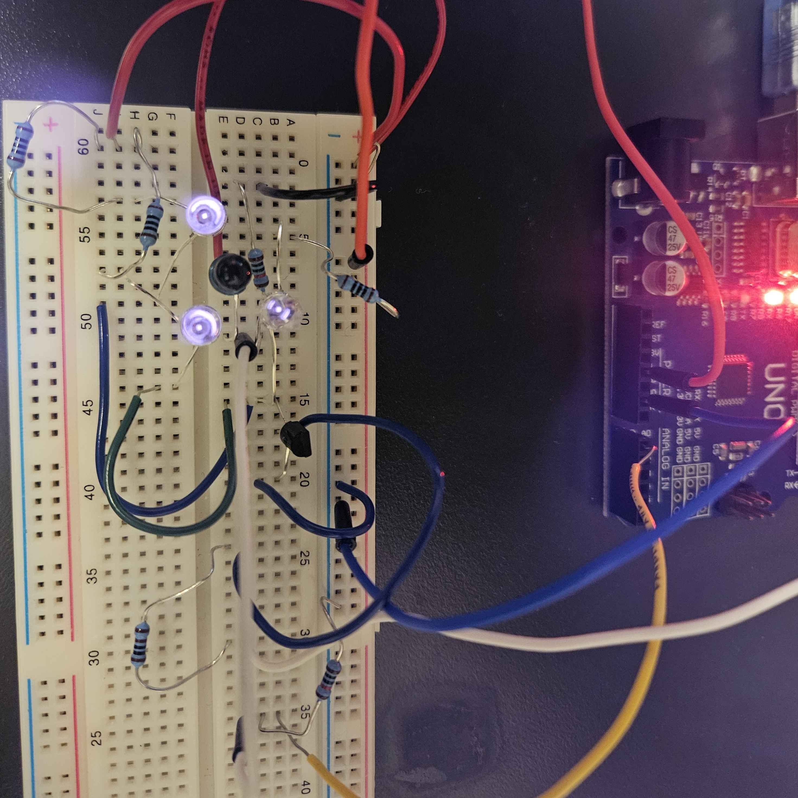
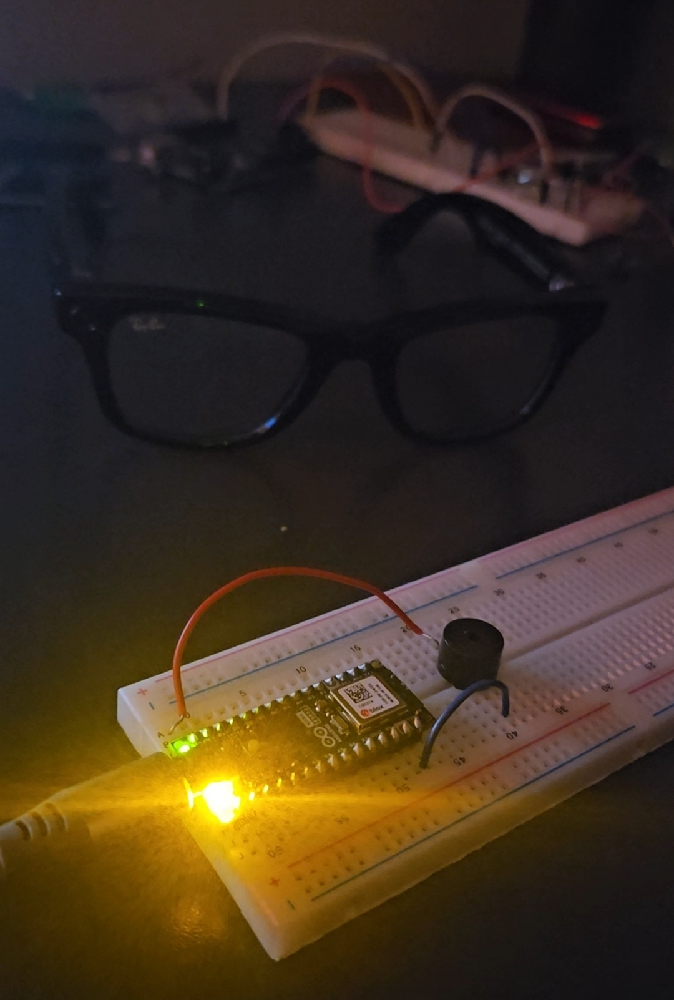

# Ban-Rays
**Glasses to detect smart-glasses that have cameras**

I'm experimenting with 2 main approaches:
* [Optics](#optics): classify the camera using light reflections.
* [Networking](#networking): bluetooth and wi-fi analysis.

So far fingerprinting specific devices based on bluetooth (BLE) is looking like easiest and most reliable approach. The picture below is the first version, which plays the legend of zelda 'secret found' jingle when it detects a BLE advertisement from Meta Raybans.



I'm essentially treating this README like a logbook, so it will have my current approaches/ideas.


Back when I released this initial research around November 2025 it hit top of hackernews and got some nice tweets! I also got to show it to some cool people at Atelier Showcase.

## Optics

By sending IR at camera lenses, we can take advantage of the fact that the CMOS sensor in a camera reflects light directly back at the source (called 'retro-reflectivity' / 'cat-eye effect') to identify cameras.



This isn't exactly a new idea. Some researchers in 2005 used this property to create 'capture-resistant environments' when smartphones with cameras were gaining popularity. 
* https://homes.cs.washington.edu/~shwetak/papers/cre.pdf

There's even some recent research (2024) that figured out how to classify individual cameras based on their retro-reflections.
* https://opg.optica.org/oe/fulltext.cfm?uri=oe-32-8-13836

Now we have a similar situation to those 2005 researchers on our hands, where smart glasses with hidden cameras seem to be getting more popular. So I want to create a pair of glasses to identify these. Unfortunately, from what I can tell most of the existing research in this space records data with a camera and then uses ML, a ton of controlled angles, etc. to differentiate between normal reflective surfaces and cameras. 

I would feel pretty silly if my solution uses its own camera. So I'll be avoiding that. Instead I think it's likely I'll have to rely on being consistent with my 'sweeps', and creating a good classifier based on signal data. For example you can see here that the back camera on my smartphone seems to produce quick and large spikes, while the glossy screen creates a more prolonged wave. 





After getting to test some Meta Raybans, I found that this setup is not going to be sufficient. Here's a test of some sweeps of the camera-area + the same area when the lens is covered. You can see the waveform is similar to what I saw in the earlier test (short spike for camera, wider otherwise), but it's wildly inconsistent and the strength of the signal is very weak. This was from about 4 inches away from the LEDs. I didn't notice much difference when swapping between 940nm and 850nm LEDs.



So at least with current hardware that's easy for me to access, this probably isn't enough to differentiate accurately.

Another idea I had is to create a designated sweep 'pattern'. The user (wearing the detector glasses) would perform a specific scan pattern of the target. Using the waveforms captured from this data, maybe we can more accurately fingerprint the raybans. For example, sweeping across the targets glasses in a 'left, right, up, down' approach. I tested this by comparing the results of the Meta raybans vs some aviators I had lying around. I think the idea behind this approach is sound (actually it's light), but it might need more workshopping.



### IR Circuit

For prototyping, I'm using:
* Arduino uno
* a bunch of 940nm and 850nm IR LEDs
* a photodiode as a receiver
* a 2222A transistor



IR TODOs:
* experiment with sweeping patterns
* focus on spectral info, try combining data from a few different wavelengths
* collimation?

* trevor (author of the camera classification paper) mentioned back in november that if the glasses have LiDAR i could just look for those pulses. the ray-bans don't seem to have this, but other smart glasses might. this blog posted in december has some cool research on detecting iphone cameras with this approach: https://www.atredis.com/blog/2025/11/20/designing-a-passive-lidar-detection-sensor

## Networking

This has been more tricky than I first thought! My current approach here is to fingerprint the Meta Raybans over Bluetooth low-energy (BLE) advertisements. But, **I have only been able to detect BLE traffic during 1) pairing 2) powering-on**. I sometimes also see the advertisement as they are taken out of the case (while already powered on), but not consistently. 



The goal is to detect them during usage when they're communicating with the paired phone, but to see this type of directed BLE traffic I would first need to see the `CONNECT_REQ` packet which has information as to what which of the communication channels to hop between in sync (hop interval, hop increment). This can be done with an [nRF52840 + the ble-sniffer firmware](https://academy.nordicsemi.com/courses/bluetooth-low-energy-fundamentals/lessons/lesson-6-bluetooth-le-sniffer/topic/nrf-sniffer-for-bluetooth-le/), but it doesn't negate the fact that **you still need to see that initial connection to start sniffing**. 

A bit more background on BLE:
* operates over 40 channels, 3 of which are dedicated just for advertising while the others are for actual data. 
* modern devices (like the meta ray-bans) have randomized public MAC addresses for privacy. Even though IEEE assigns certain MAC address prefixes (OUI, 'Organizationally Unique Identifier'), the randomization means this doesn't appear to be useful for detection. 
* to follow a conversation on the data channels, you need to have observed the initial connection request packet with has required info in it
* the advertising data contains good stuff, but isn't necessarily sent out super often. when extended advertising is used to get a bigger payload size, the other channels can be used for it. 
* https://academy.nordicsemi.com/courses/bluetooth-low-energy-fundamentals/lessons/lesson-2-bluetooth-le-advertising/topic/advertisement-packet/
* you can send a SCAN_REQ to devices that are advertising and they (can choose to) respond with more data about themselves ('active scanning')

When turned on or put into pairing mode (or sometimes when taken out of the case), I can detect the device through advertised manufacturer data and service UUIDs. These are parts of the advertising data.
`0x01AB` is a Meta-specific SIG-assigned ID (assigned by the Bluetooth standards body), and `0xFD5F` in the Service UUID is assigned to Meta as well. In the code you can see the other numbers I'm using for fingerprinting.
* https://www.bluetooth.com/wp-content/uploads/Files/Specification/HTML/Assigned_Numbers/out/en/Assigned_Numbers.pdf

For any of the bluetooth classic (BTC) traffic, unfortunately the hardware seems a bit more involved (read: expensive). So if I want to do down this route, I'll likely need a more clever solution here.

capture when the glasses are powered on:
```
[01:07:06] RSSI: -59 dBm
Address: XX:XX:XX:XX:XX:XX
Name: Unknown

META/LUXOTTICA DEVICE DETECTED!
  Manufacturer: Meta (0x01AB)
  Service UUID: Meta (0xFD5F) (0000fd5f-0000-1000-8000-00805f9b34fb)

Manufacturer Data:
  Company ID: Meta (0x01AB)
  Data: 020102102716e4

Service UUIDs: ['0000fd5f-0000-1000-8000-00805f9b34fb']
```

NETWORKING TODOs:
* Read: https://dl.acm.org/doi/10.1145/3548606.3559372 and any other recent papers 
* Wi-Fi direct stuff with esp32
* see if the nrf52840 sees anything on adv that the esp32 doesn't. 
  * I bought the chip (xiao nrf52840) to test out sniffing, but I should've just got the dongle or a dev-kit. the nordic ble-sniffer firmware isn't made for it so it's taking some more effort.
* will phones advertise more often and show specific services? anything the phone might do differently when paired to an active device that i can use as a side channel?
* read more into the PHY modes

---

NOTE: ray-bans that i was using for testing are currently unavailable so i'm a bit blocked :(

---

Thanks to Trevor Seets and Junming Chen for their advice in optics and BLE (respectively). Also to Sohail for lending me meta raybans to test with. 

---

[![CC BY-NC-SA 4.0][cc-by-nc-sa-shield]][cc-by-nc-sa]

This work is licensed under a
[Creative Commons Attribution-NonCommercial-ShareAlike 4.0 International License][cc-by-nc-sa].

[![CC BY-NC-SA 4.0][cc-by-nc-sa-image]][cc-by-nc-sa]

[cc-by-nc-sa]: http://creativecommons.org/licenses/by-nc-sa/4.0/
[cc-by-nc-sa-image]: https://licensebuttons.net/l/by-nc-sa/4.0/88x31.png
[cc-by-nc-sa-shield]: https://img.shields.io/badge/License-CC%20BY--NC--SA%204.0-lightgrey.svg