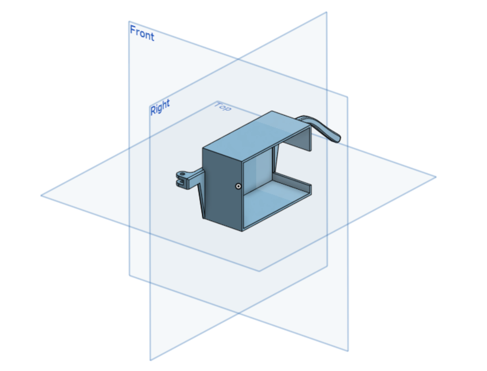

## stuff for the actual glasses

1. detect presense of meta raybans / other camera glasses
2. alert wearer (currently plays the legend of zelda secret found jingle)
3. potentially turn on a ton of IR-leds to make the wearer difficult to identify through a camera

For mechanical side, i bought a $1 pair of sunglasses, unscrewed one of the hinges, re-created it with CAD, and modified it a bit so there's a spot to hold electronics.

`arm_and_box.step`

